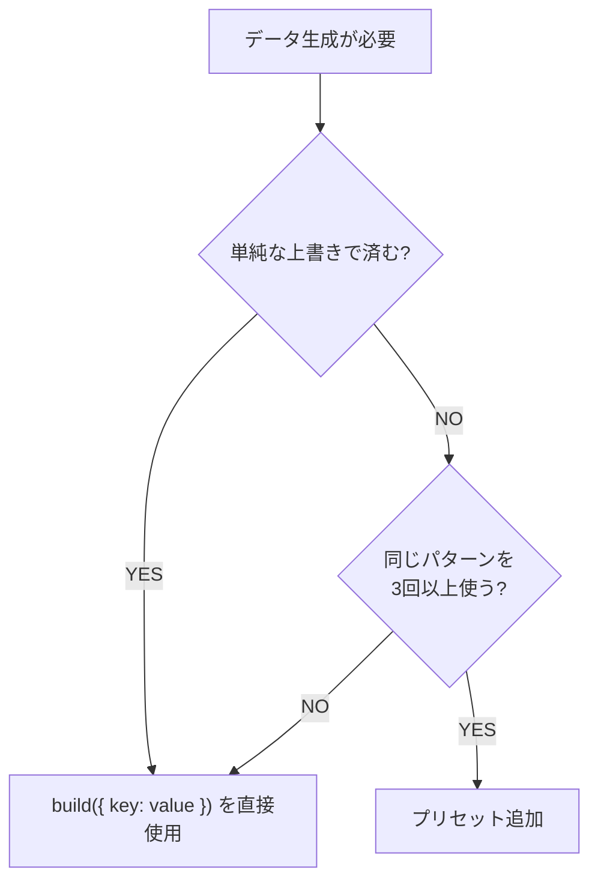

# ファクトリ規約

```yaml
記号: ✅=必須 | ❌=禁止 | ⚠️=注意
適用: test/factories/
ライブラリ: factory.ts ^1.4.2
目的: 型安全性 / 一貫性 / テスト独立性
```

---

## §0 概要

### 目的

テストコードで使用するダミーデータの生成方法を標準化する。
手動でオブジェクトリテラルを書く代わりに、ファクトリパターンを使用して一元管理する。

### factory.ts 基本

```typescript
// makeFactoryでデフォルト値を定義 → build()で生成
const userFactory = Factory.Sync.makeFactory<User>({
  id: Factory.each((i) => `user_${i + 1}`),  // 連番生成
  name: "デフォルト名",
  email: "test@example.com",
});

const user = userFactory.build();                    // デフォルト値で生成
const user = userFactory.build({ name: "カスタム" }); // 一部上書き
```

### 用語定義

| 用語 | 定義 |
| ---- | ---- |
| `overrides` | `build({ ... })`に渡す上書き値 |
| `createFactoryWrapper` | factory.tsをラップし、`build`/`buildList`/`_factory`を提供 |
| `createDatabaseFactoryWrapper` | DB保存機能付きラッパー（`create()`メソッド追加） |
| `プリセット` | 頻出パターンを事前定義したバリエーション（例: `UserTestDataFactories.admin`） |

### 前提条件

```yaml
パスエイリアス:
  "test/factories": test/factories/index.ts

自動実行:
  - Factory.each() による連番はビルド時に自動インクリメント
```

---

## §1 命名規則

### §1.1 ファイル・エクスポート

```yaml
principle: 1ファイル = 1エンティティ

naming:
  file: "{entity}-test-data.factory.ts"  # kebab-case
  export: "{Entity}TestDataFactories"    # PascalCase + Factories
  database: "Database{Entity}DataFactory" # DB保存用

unit:
  rule: 1ファイルにつき1つのエンティティのファクトリのみ定義
  rationale: 単一責任 / 変更影響最小化 / テストとの1対1対応
```

### §1.2 ディレクトリ構造

```text
test/factories/
├── base.factory.ts                      # 共通基盤
├── index.ts                             # ルートエントリーポイント
├── CLAUDE.md                            # 本規約
├── user-test-data.factory.ts            # ユーザー
├── library-test-data.factory.ts         # ライブラリ
├── library-summary-test-data.factory.ts # ライブラリ要約
└── github-scraper-test-data.factory.ts  # GitHubスクレイパー
```

---

## §2 ファクトリ実装

### §2.1 標準テンプレート（プリセット付き）

```typescript
import * as Factory from 'factory.ts';
import { createFactoryWrapper, type FactoryWrapper } from './base.factory.js';

export type MyEntityTestData = { /* ... */ };

// 1. ベースファクトリ
const baseFactory = Factory.Sync.makeFactory<MyEntityTestData>({
  id: Factory.each((i) => `entity_${i + 1}`),
  name: 'デフォルト名',
  status: 'active',
});

// 2. プリセット定義
export const MyEntityTestDataFactories: Record<string, FactoryWrapper<MyEntityTestData>> = {
  default: createFactoryWrapper(baseFactory),
  inactive: createFactoryWrapper(
    baseFactory.extend({
      status: 'inactive',
    })
  ),
};
```

### §2.2 DB保存機能付きファクトリ（createDatabaseFactoryWrapper）

E2Eテストやインテグレーションテストでデータベースに直接レコードを作成する場合に使用する。

#### シグネチャ

```typescript
createDatabaseFactoryWrapper<T, TReturn = string>(
  tableName: string,                              // エラーログ用テーブル名
  factory: Factory.Sync.Factory<T, keyof T>,      // ベースファクトリ
  insertFn: (db: DrizzleDB, data: T) => Promise<TReturn>  // 挿入ロジック
): DatabaseFactoryWrapper<T, TReturn>
```

#### 提供メソッド

| メソッド | 説明 |
| -------- | ---- |
| `build(overrides?)` | オブジェクト生成（DB保存なし） |
| `buildList(count, overrides?)` | 複数オブジェクト生成（DB保存なし） |
| `create(overrides?)` | DB保存付きオブジェクト生成（IDを返す） |
| `_factory` | 派生ファクトリ作成用の内部ファクトリ |

#### 実装手順

```yaml
steps:
  1: 型定義 - DB挿入に必要な全フィールドを含む型を定義
  2: ファクトリ定義 - 一意フィールドにFactory.each()またはgenerateUniqueId()使用
  3: ラッパー作成 - createDatabaseFactoryWrapperで挿入ロジックを定義
  4: エクスポート - index.tsに追加
```

#### 完全な実装例

```typescript
import * as Factory from 'factory.ts';
import { user } from '../../src/lib/server/db/schema';
import {
  createDatabaseFactoryWrapper,
  generateUniqueId,
} from './base.factory.js';

// Step 1: 型定義（DBスキーマから推論 or 明示定義）
export interface DatabaseUserData {
  id: string;
  email: string;
  name: string;
  picture: string | undefined;
  googleId: string;
}

// Step 2: ファクトリ定義（一意性が必要なフィールドに注意）
const databaseUserFactory = Factory.Sync.makeFactory<DatabaseUserData>({
  // ✅ 一意ID: generateUniqueId()で衝突回避
  id: Factory.each(() => generateUniqueId('user')),
  // ✅ 一意メール: タイムスタンプで衝突回避
  email: Factory.each(() => `test-${Date.now()}@example.com`),
  name: 'Test User',
  picture: 'https://example.com/avatar.jpg',
  // ✅ 一意外部ID: タイムスタンプ+ランダム文字列
  googleId: Factory.each(
    () => `google_${Date.now()}_${Math.random().toString(36).substring(2, 11)}`
  ),
});

// Step 3: ラッパー作成
export const DatabaseUserDataFactory = createDatabaseFactoryWrapper<DatabaseUserData>(
  'user',  // エラーログ用テーブル名
  databaseUserFactory,
  async (db, userData) => {
    // Drizzle ORMのinsert APIを使用
    const result = await db
      .insert(user)
      .values({
        id: userData.id,
        email: userData.email,
        name: userData.name,
        picture: userData.picture,
        googleId: userData.googleId,
      })
      .returning({ id: user.id });

    return result[0].id;  // 作成されたIDを返す
  }
);
```

#### 使用例

```typescript
import { DatabaseUserDataFactory } from '../factories/index.js';

// デフォルト値でDB作成
const userId = await DatabaseUserDataFactory.create();

// カスタム値でDB作成
const adminId = await DatabaseUserDataFactory.create({
  email: 'admin@example.com',
  name: 'Admin User',
});

// DB保存なしでオブジェクト生成（ユニットテスト用）
const userData = DatabaseUserDataFactory.build();
```

#### 規約

```yaml
✅ 必須:
  - id: generateUniqueId(prefix)またはFactory.each()で一意性保証
  - email等の一意制約フィールド: タイムスタンプやランダム値で衝突回避
  - insertFn: Drizzle ORMのinsert().values().returning()パターン使用
  - 戻り値: 作成されたレコードのIDを返す

⚠️ 注意:
  - create()は毎回新規DB接続を作成・クローズする
  - テスト終了後のデータクリーンアップは別途必要
  - 外部キー制約がある場合は依存レコードを先に作成

❌ 禁止:
  - 固定値のIDやメール（テスト間で衝突する）
  - insertFn内でのトランザクション開始（接続管理はラッパーが担当）
```

#### 外部キー制約がある場合

```typescript
// 先に依存レコードを作成
const userId = await DatabaseUserDataFactory.create();

// 外部キーを指定してレコード作成
const libraryId = await DatabaseLibraryDataFactory.create({
  authorId: userId,  // 外部キー
});
```

### §2.3 index.ts の書き方

```typescript
// factories/index.ts
export {
  createFactoryWrapper,
  createDatabaseFactoryWrapper,
  generateUniqueId,
  type FactoryWrapper,
  type DatabaseFactoryWrapper,
} from './base.factory';

export {
  UserTestDataFactories,
  DatabaseUserDataFactory,
} from './user-test-data.factory';
```

---

## §3 使用方法

### §3.1 基本操作

```typescript
import { UserTestDataFactories, LibraryTestDataFactories } from '../factories/index.js';

// オブジェクト生成
const user = UserTestDataFactories.default.build();                    // デフォルト値
const user = UserTestDataFactories.default.build({ name: "カスタム" }); // 一部上書き
const users = UserTestDataFactories.default.buildList(3);              // 複数生成

// プリセット使用
const admin = UserTestDataFactories.admin.build();
const admin = UserTestDataFactories.admin.build({ email: "admin@example.com" });
```

### §3.2 DB保存

```typescript
import { DatabaseUserDataFactory, DatabaseLibraryDataFactory } from '../factories/index.js';

// E2Eテスト等でDBにデータ作成
const userId = await DatabaseUserDataFactory.create();
const libraryId = await DatabaseLibraryDataFactory.create({ name: "カスタムライブラリ" });
```

### §3.3 APIメソッド

| メソッド | 用途 | 例 |
| -------- | ---- | --- |
| `Factory.each((i) => ...)` | シーケンス番号生成 | `id: Factory.each((i) => \`id_${i}\`)` |
| `factory.extend({ ... })` | 派生ファクトリ作成 | プリセットバリエーション |
| `generateUniqueId(prefix)` | 一意ID生成 | `generateUniqueId('user')` |

---

## §4 プリセット設計

**原則:** 頻出パターンのみプリセット化、過度な抽象化を避ける

### §4.1 パターン選択



### §4.2 プリセット例

```typescript
export const UserTestDataFactories: Record<string, FactoryWrapper<UserTestData>> = {
  default: createFactoryWrapper(baseUserFactory),
  admin: createFactoryWrapper(
    baseUserFactory.extend({
      email: 'admin@example.com',
      name: 'Admin User',
    })
  ),
  guest: createFactoryWrapper(
    baseUserFactory.extend({
      email: 'guest@example.com',
      picture: undefined,
    })
  ),
};
```

---

## §5 禁止事項

| ルール | 理由 |
| ------ | ---- |
| ❌ オブジェクトリテラル手動作成 | 生成元一元管理のため |
| ❌ `any` 型使用（ラッパー内除く） | 型安全性維持 |
| ❌ 未使用プリセット作成 | YAGNI原則 |
| ❌ 重複フィールド定義 | base.factory.ts活用 |

---

## §6 参照

- [factory.ts GitHub](https://github.com/willryan/factory.ts)
- [factory.ts npm](https://www.npmjs.com/package/factory.ts)
- 上位規約: `CLAUDE.md`
